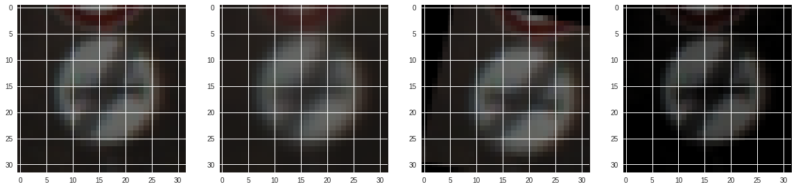

# **Traffic Sign Recognition** 

**Build a Traffic Sign Recognition Project**

The goals / steps of this project are the following:
* Load the data set (see below for links to the project data set)
* Explore, summarize and visualize the data set
* Design, train and test a model architecture
* Use the model to make predictions on new images
* Analyze the softmax probabilities of the new images
* Summarize the results with a written report

### Data Set Summary & Exploration

#### 1. Provide a basic summary of the data set. In the code, the analysis should be done using python, numpy and/or pandas methods rather than hardcoding results manually.

I used the pandas library to calculate summary statistics of the traffic
signs data set:

* The size of training set is 34799
* The size of the validation set is 4410
* The size of test set is 12630
* The shape of a traffic sign image is (32, 32)
* The number of unique classes/labels in the data set is 43

#### 2. Include an exploratory visualization of the dataset.

Here is an exploratory visualization of the data set. It is a bar chart showing how the samples are distributed


### Design and Test a Model Architecture

#### 1. Describe how you preprocessed the image data. What techniques were chosen and why did you choose these techniques? Consider including images showing the output of each preprocessing technique. Pre-processing refers to techniques such as converting to grayscale, normalization, etc. (OPTIONAL: As described in the "Stand Out Suggestions" part of the rubric, if you generated additional data for training, describe why you decided to generate additional data, how you generated the data, and provide example images of the additional data. Then describe the characteristics of the augmented training set like number of images in the set, number of images for each class, etc.)

The dataset for training is not so big and the distribution of samples is not uniform. To improve the quality of the training dataset, artificial augmentation is performed:
* Depending on the sample sizes of each class in the training dataset, a random number of additional images are generated. The smaller the size of the original class, the higher the probability that additional images are generated for that class.
 * the goal is to make the distribution of training samples more uniform (see below).
* Three image transform operations are randomly selected for the generation of new images:
 * blurring.
 * rotating w.r.t a randomly selected pivot point on the image.
 * brightness adjustment.

Here is an example of an original image and augmented images (this time all three image transform operations are performed. In practice, none to all three may be performed. ):



As a last step, I normalized the image data to the range of [0, 1], aiming for a better behavior of grediant decent convergence during training time.

Now, the sample distribution across classes in the training dataset shows:


#### 2. Describe what your final model architecture looks like including model type, layers, layer sizes, connectivity, etc.) Consider including a diagram and/or table describing the final model.

My final model is exactly the same as LeNet except that an additional convolutional layer (using 32 filters of size 2x2) is added just before the first fully connected layer.

####3. Describe how you trained your model. The discussion can include the type of optimizer, the batch size, number of epochs and any hyperparameters such as learning rate.

To train the model, I used `xavier_initializer` for the weights and `zero_initializer` for the biases. A 0.5 drop_out rate is used on the last two fully-connected layers. I tried a variaty of learning rates and epochs, and finally got a model that has a training accuracy of 98.7% and validation accuracy of 96.3%. 

#### 4. discuss why you think the architecture is suitable for the current problem.

I added an additional convolutional layer to the LeNet because typically we need at least 3 levels of abstraction to better represent the content of an image. This choice worked better than the original LeNet which never achieved above 80% accuracy in my experiments.

My final model results were:
* training set accuracy of 98.7%
* validation set accuracy of 96.3%
* test set accuracy of 94.7%

The epoch numbers and learning rates are tuned according to convergence recordings on Tensorboard. We generally want a faster learning rate however if the learning rate is two high, the model jumps around the global minimum rather than continue the descent. I finally used an epoch number of 80 which leads to a computation cost that I can afford.

### Test a Model on New Images

#### 1. Choose five German traffic signs found on the web and provide them in the report. For each image, discuss what quality or qualities might be difficult to classify.

Here are the random traffic signs that I found on the web:


The 5th image might be difficult to classify because it is from Thailand (not German).

#### Discuss the model's predictions on these new traffic signs and compare the results to predicting on the test set. At a minimum, discuss what the predictions were, the accuracy on these new predictions, and compare the accuracy to the accuracy on the test set (OPTIONAL: Discuss the results in more detail as described in the "Stand Out Suggestions" part of the rubric).

Here are the results of the prediction:


| Image			        |     Prediction	        					| 
|:---------------------:|:---------------------------------------------:| 
| Children Crossing      		|   Children Crossing (95%)									| 
|   Right-of-way at the next intersection   			| 			Right-of-way at the next intersection (100%)							|
| 		No entry		| 			No entry(100%)							|
|    General caution		| 				General caution(100%) 				|
| Turn right	ahead		| 				Speed limit (20km/h)(82%)			|
| 	Turn right ahead | 			Turn right ahead(100%)		|
| 	Road work		|	Road work(100%)		|
|	Stop		| 			Stop(100%)			|

The model was able to correctly guess 7 of the 8 traffic signs, which gives an accuracy of 87.5%. 

#### 3. Describe how certain the model is when predicting on each of the five new images by looking at the softmax probabilities for each prediction. Provide the top 5 softmax probabilities for each image along with the sign type of each probability. (OPTIONAL: as described in the "Stand Out Suggestions" part of the rubric, visualizations can also be provided such as bar charts)

The code for making predictions on my final model is here:
```python
with tf.Session() as sess:
    loader = tf.train.import_meta_graph('./LeNetPlus.meta')
    loader.restore(sess, tf.train.latest_checkpoint('./'))

    sess = tf.get_default_session()
    
    prob, index = sess.run(tf.nn.top_k(tf.nn.softmax(logits), 5), feed_dict={x: X_norm, keep_prob: 1.})
    plt.figure(figsize=(25,5))
    plt.subplot(1,len(images32),1)
    for i in range(len(images32)):
        plt.subplot(1,len(images32),i+1)
        plt.imshow(images32[i])
        plt.title("label:{}, \n {}".format(index[i][0], label_map[index[i][0]]))

for i in range(len(images32)):
    print("image", i+1, " preditions: ")
    for p, idx in zip(prob[i], index[i]):
        label_text = label_map[idx].strip()
        percentage = "{0:.0f}%".format(p*100)
        description = label_text + "(" + percentage + ")"
        print(">>>>>", description)
```

The output is the following:
`
image 1  preditions: 
>>>>> Children crossing(95%)
>>>>> Road narrows on the right(3%)
>>>>> Pedestrians(1%)
>>>>> Beware of ice/snow(0%)
>>>>> Right-of-way at the next intersection(0%)
image 2  preditions: 
>>>>> Right-of-way at the next intersection(100%)
>>>>> Beware of ice/snow(0%)
>>>>> Double curve(0%)
>>>>> Pedestrians(0%)
>>>>> Children crossing(0%)
image 3  preditions: 
>>>>> No entry(100%)
>>>>> Stop(0%)
>>>>> No passing(0%)
>>>>> No passing for vehicles over 3.5 metric tons(0%)
>>>>> Priority road(0%)
image 4  preditions: 
>>>>> General caution(100%)
>>>>> Traffic signals(0%)
>>>>> Road narrows on the right(0%)
>>>>> Pedestrians(0%)
>>>>> Bumpy road(0%)
image 5  preditions: 
>>>>> Speed limit (20km/h)(82%)
>>>>> End of speed limit (80km/h)(12%)
>>>>> Speed limit (60km/h)(2%)
>>>>> Speed limit (120km/h)(2%)
>>>>> Speed limit (30km/h)(1%)
image 6  preditions: 
>>>>> Turn right ahead(100%)
>>>>> Ahead only(0%)
>>>>> Turn left ahead(0%)
>>>>> Go straight or right(0%)
>>>>> Roundabout mandatory(0%)
image 7  preditions: 
>>>>> Road work(100%)
>>>>> Right-of-way at the next intersection(0%)
>>>>> Priority road(0%)
>>>>> Double curve(0%)
>>>>> Traffic signals(0%)
image 8  preditions: 
>>>>> Stop(100%)
>>>>> No entry(0%)
>>>>> Priority road(0%)
>>>>> No passing for vehicles over 3.5 metric tons(0%)
>>>>> No passing(0%)
`


### (Optional) Visualizing the Neural Network (See Step 4 of the Ipython notebook for more details)
####1. Discuss the visual output of your trained network's feature maps. What characteristics did the neural network use to make classifications?


